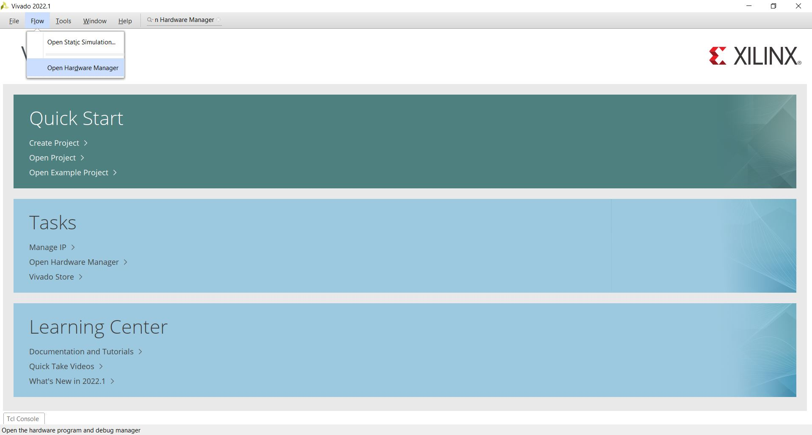
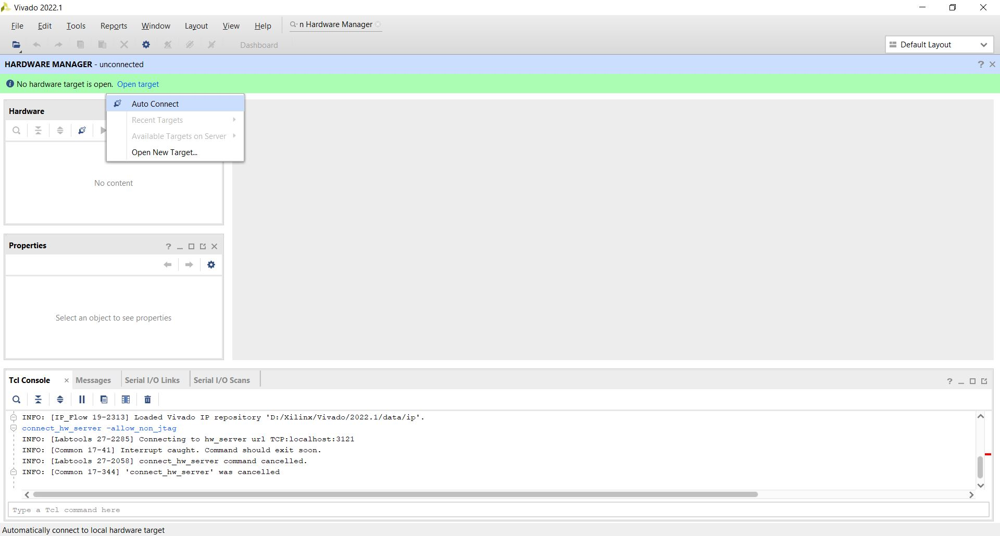
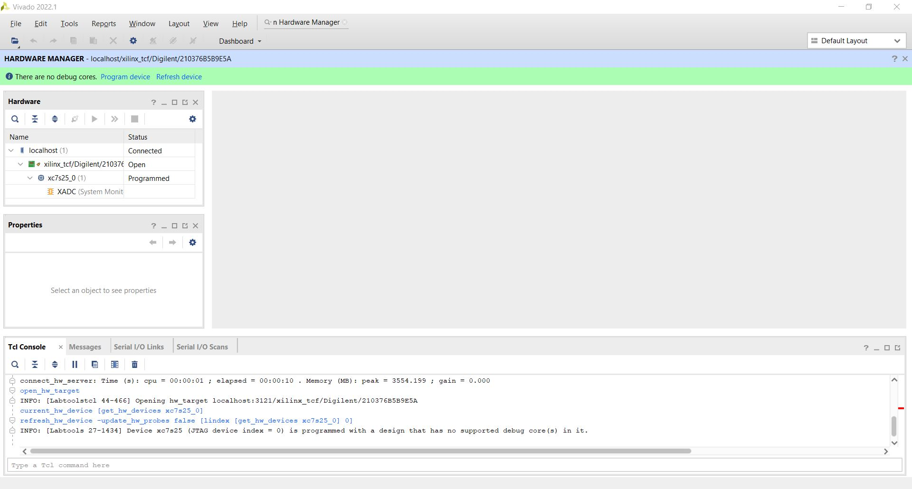
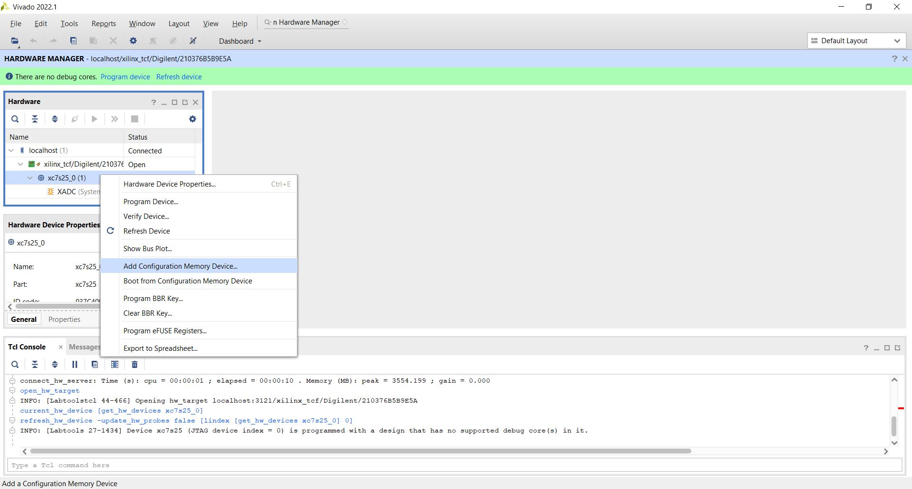
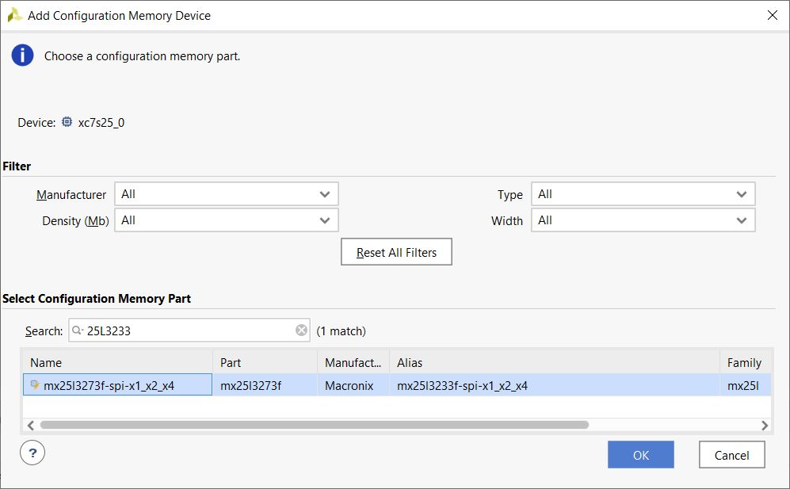
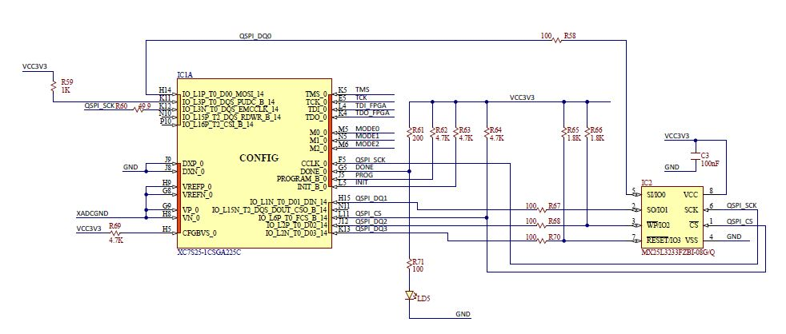
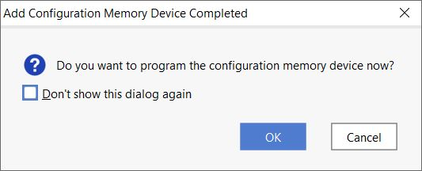
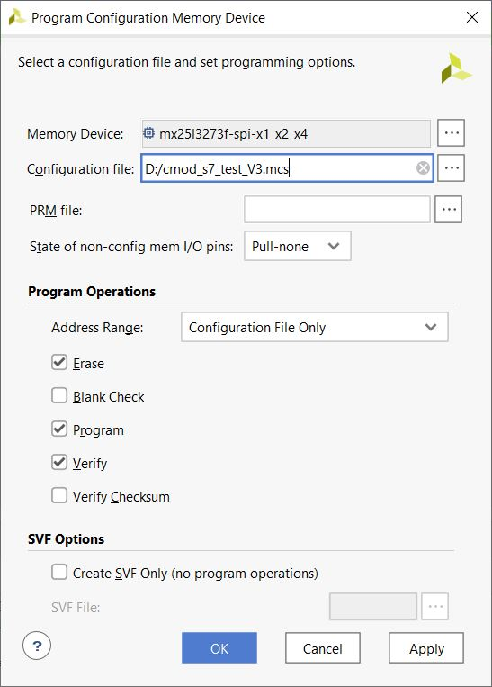
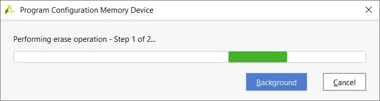
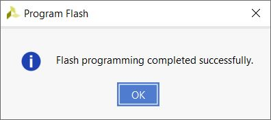

# Vivado Flash Tutorial
## 1. Open Hardware Manager
Flow &rArr; Open Hardware Manager  

## 2. Open Target & connect
Open target &rArr; Auto Connect  

## 3. Add memory device
click right button on your device   
Add configure Memory Device &rArr; 

And select your flash, you can figure out in the datasheet or schmatic

## program Device
After adding memory device, you can program device
select "OK" and continue

Select bin/mcs file 
  
after select OK, it will program

just wait a minute and you get a new program in your FPGA

Ref:  
[Vivado如何生成BIN或MCS文件并烧写到FLASH中](https://blog.csdn.net/weixin_42837669/article/details/121625188)  
[申請 Xilinx 帳號、Vivado、WebPACK License 快速流程](http://media.ee.ntu.edu.tw/courses/msoc/0_zedlab0.pdf)

